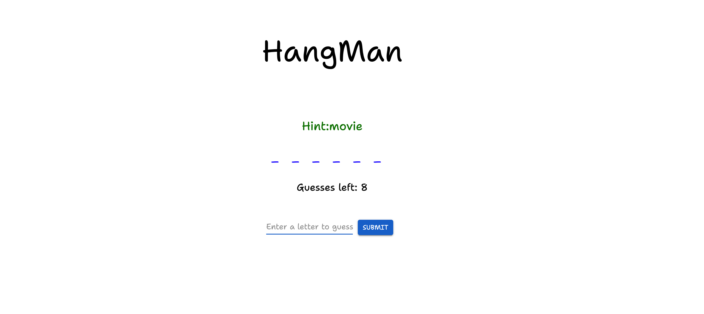

# Hangman

This is a game app called Hangman, and it bootstrapped with `create-react-app`.




## Tech Stack

- React
- Material UI

## Features

- Get ramdon words to guess with a hint 
- Enter a letter each time 
- 8 guesses


## Installation

### 1. Clone the repository

```bash
git clone https://github.com/Tiaanz/Hangman-React.git
```

### 2. Install dependencies

```bash
npm install
```


### 3. Run the application

```bash
npm start
```

